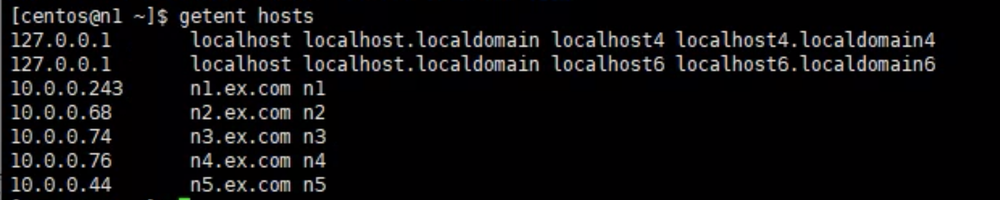
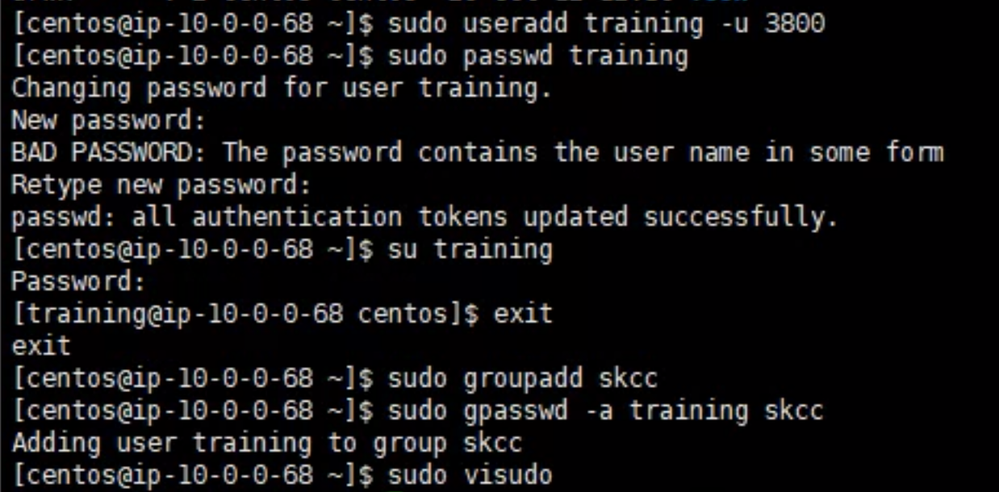
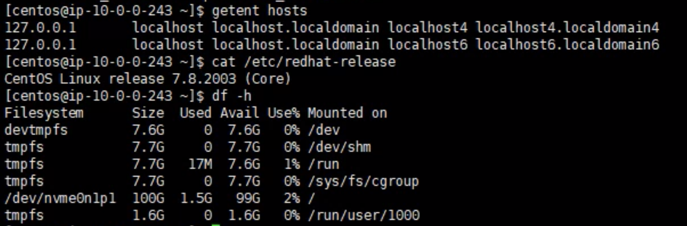
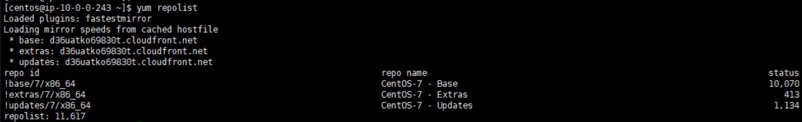
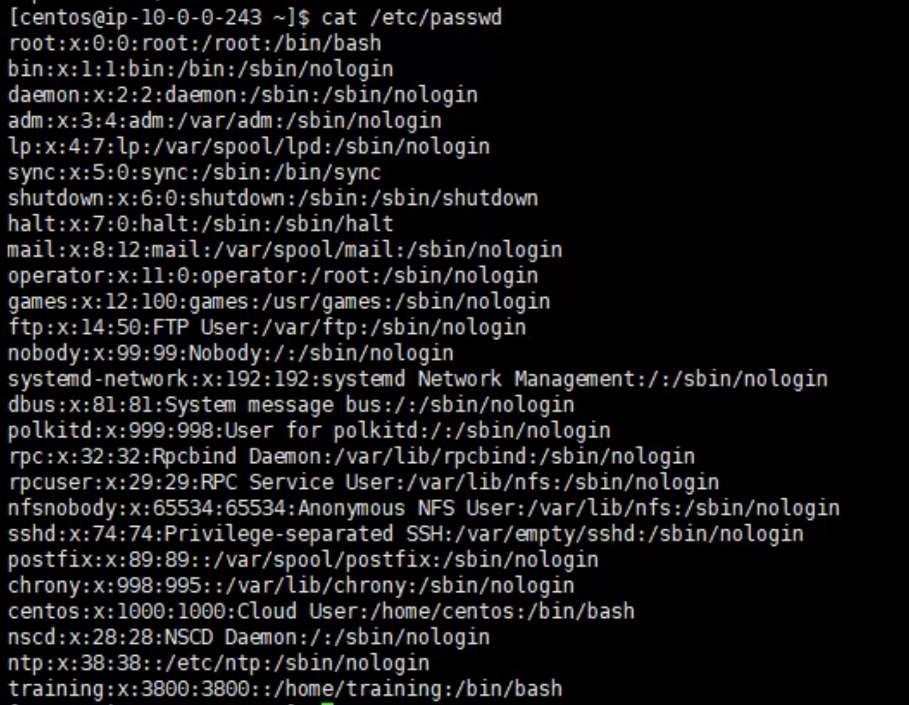
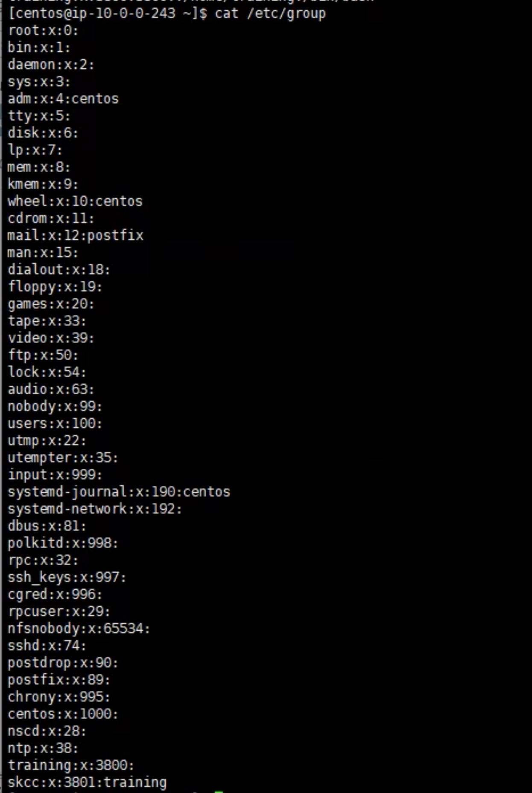
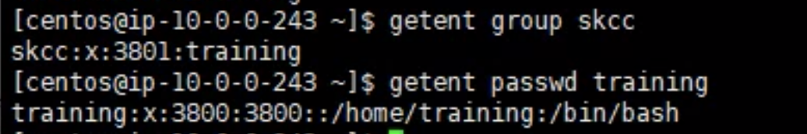
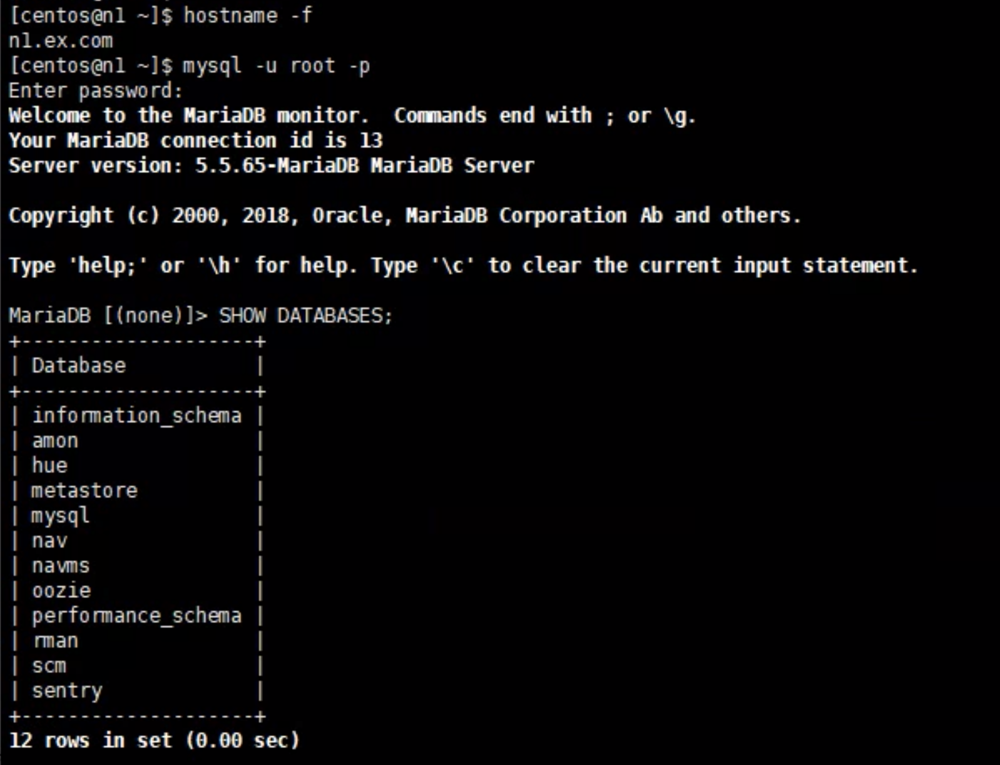
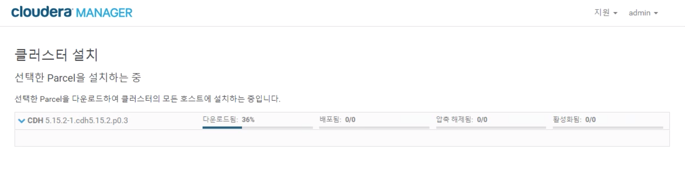

1. Create a CDH cluster on AWS

a. linux setup

```bash
sudo vi /etc/hosts

10.0.0.243 n1.ex.com n1
10.0.0.68 n2.ex.com n2
10.0.0.74 n3.ex.com n3
10.0.0.76 n4.ex.com n4
10.0.0.44 n5.ex.com n5

sudo hostnamectl set-hostname n1.ex.com
```



```bash
ssh-keygen -t rsa
cat id_rsa.pub >> authorized_keys
```

```bash
sudo useradd training -u 3800
sudo passwd training # training
sudo groupadd skcc
sudo gpasswd -a training skcc
sudo visudo # training ALL=(ALL) ALL
```



```bash
getent hosts
cat /etc/redhat-release # CentOS Linux release 7.8.2003 (Core)
df -h
```



```bash
yum repolist
```



```bash
cat /etc/passwd
```



```bash
cat /etc/group
```



```bash
getent group skcc
getent passwd training
```




b. Install a MySQL server

```bash
sudo yum install -y wget
sudo yum install -y mariadb-server
sudo systemctl stop mariadb
sudo vi /etc/my.cnf
```

```bash
[mysqld]
datadir=/var/lib/mysql
socket=/var/lib/mysql/mysql.sock
transaction-isolation = READ-COMMITTED
# Disabling symbolic-links is recommended to prevent assorted security risks;
# to do so, uncomment this line:
symbolic-links = 0
# Settings user and group are ignored when systemd is used.
# If you need to run mysqld under a different user or group,
# customize your systemd unit file for mariadb according to the
# instructions in http://fedoraproject.org/wiki/Systemd

key_buffer = 16M
key_buffer_size = 32M
max_allowed_packet = 32M
thread_stack = 256K
thread_cache_size = 64
query_cache_limit = 8M
query_cache_size = 64M
query_cache_type = 1

max_connections = 550
#expire_logs_days = 10
#max_binlog_size = 100M

#log_bin should be on a disk with enough free space.
#Replace '/var/lib/mysql/mysql_binary_log' with an appropriate path for your
#system and chown the specified folder to the mysql user.
log_bin=/var/lib/mysql/mysql_binary_log

#In later versions of MariaDB, if you enable the binary log and do not set
#a server_id, MariaDB will not start. The server_id must be unique within
#the replicating group.
server_id=1

binlog_format = mixed

read_buffer_size = 2M
read_rnd_buffer_size = 16M
sort_buffer_size = 8M
join_buffer_size = 8M

# InnoDB settings
innodb_file_per_table = 1
innodb_flush_log_at_trx_commit  = 2
innodb_log_buffer_size = 64M
innodb_buffer_pool_size = 4G
innodb_thread_concurrency = 8
innodb_flush_method = O_DIRECT
innodb_log_file_size = 512M

[mysqld_safe]
log-error=/var/log/mariadb/mariadb.log
pid-file=/var/run/mariadb/mariadb.pid

#
# include all files from the config directory
#
!includedir /etc/my.cnf.d
```

```bash
sudo systemctl enable mariadb
sudo systemctl start mariadb
sudo /usr/bin/mysql_secure_installation
```

```bash
[...]
Enter current password for root (enter for none):
OK, successfully used password, moving on...
[...]
Set root password? [Y/n] Y
New password: training
Re-enter new password: training
[...]
Remove anonymous users? [Y/n] Y
[...]
Disallow root login remotely? [Y/n] N
[...]
Remove test database and access to it [Y/n] Y
[...]
Reload privilege tables now? [Y/n] Y
[...]
All done!  If you've completed all of the above steps, your MariaDB
installation should now be secure.

Thanks for using MariaDB!
```

```bash
hostname -f # n1.ex.com
mysql -u root -p # training

CREATE DATABASE scm DEFAULT CHARACTER SET utf8 DEFAULT COLLATE utf8_general_ci;
GRANT ALL ON scm.* TO 'scm'@'%' IDENTIFIED BY 'training';
CREATE DATABASE amon DEFAULT CHARACTER SET utf8 DEFAULT COLLATE utf8_general_ci;
GRANT ALL ON amon.* TO 'amon'@'%' IDENTIFIED BY 'training';
CREATE DATABASE rman DEFAULT CHARACTER SET utf8 DEFAULT COLLATE utf8_general_ci;
GRANT ALL ON rman.* TO 'rman'@'%' IDENTIFIED BY 'training';
CREATE DATABASE hue DEFAULT CHARACTER SET utf8 DEFAULT COLLATE utf8_general_ci;
GRANT ALL ON hue.* TO 'hue'@'%' IDENTIFIED BY 'training';
CREATE DATABASE metastore DEFAULT CHARACTER SET utf8 DEFAULT COLLATE utf8_general_ci;
GRANT ALL ON metastore.* TO 'hive'@'%' IDENTIFIED BY 'training';
CREATE DATABASE sentry DEFAULT CHARACTER SET utf8 DEFAULT COLLATE utf8_general_ci;
GRANT ALL ON sentry.* TO 'sentry'@'%' IDENTIFIED BY 'training';
CREATE DATABASE nav DEFAULT CHARACTER SET utf8 DEFAULT COLLATE utf8_general_ci;
GRANT ALL ON nav.* TO 'nav'@'%' IDENTIFIED BY 'training';
CREATE DATABASE navms DEFAULT CHARACTER SET utf8 DEFAULT COLLATE utf8_general_ci;
GRANT ALL ON navms.* TO 'navms'@'%' IDENTIFIED BY 'training';
CREATE DATABASE oozie DEFAULT CHARACTER SET utf8 DEFAULT COLLATE utf8_general_ci;
GRANT ALL ON oozie.* TO 'oozie'@'%' IDENTIFIED BY 'training';
GRANT ALL ON *.* TO 'training'@'%' IDENTIFIED BY 'training';
FLUSH PRIVILEGES;

MariaDB > show databases;
```



c. Install Cloudera Manager

```bash
sudo yum install -y java-1.8.0-openjdk-devel
sudo vi /etc/profile

export JAVA_HOME=/usr/lib/jvm/java-1.8.0-openjdk/jre
export PATH=$PATH:$JAVA_HOME/bin
```

```bash
wget https://dev.mysql.com/get/Downloads/Connector-J/mysql-connector-java-5.1.49.tar.gz
tar zxvf mysql-connector-java-5.1.49.tar.gz
sudo mkdir -p /usr/share/java/
cd mysql-connector-java-5.1.49
sudo cp mysql-connector-java-5.1.49-bin.jar /usr/share/java/mysql-connector-java.jar
```

```bash
sudo vi /etc/yum.repos.d/cloudera-manager.repo

[cloudera-manager]
name = Cloudera Manager, Version 5.15.2
baseurl = https://archive.cloudera.com/cm5/redhat/7/x86_64/cm/5.15.2/
gpgkey = https://archive.cloudera.com/redhat/cdh/RPM-GPG-KEY-cloudera
gpgcheck = 1

sudo rpm --import https://archive.cloudera.com/cm5/redhat/7/x86_64/cm/RPM-GPG-KEY-cloudera
```

```bash
sudo yum install -y cloudera-manager-daemons cloudera-manager-server
sudo /usr/share/cmf/schema/scm_prepare_database.sh mysql scm scm training
sudo systemctl start cloudera-scm-server
```

http://52.78.224.245:7180

```bash
n[1-5].ex.com
```


