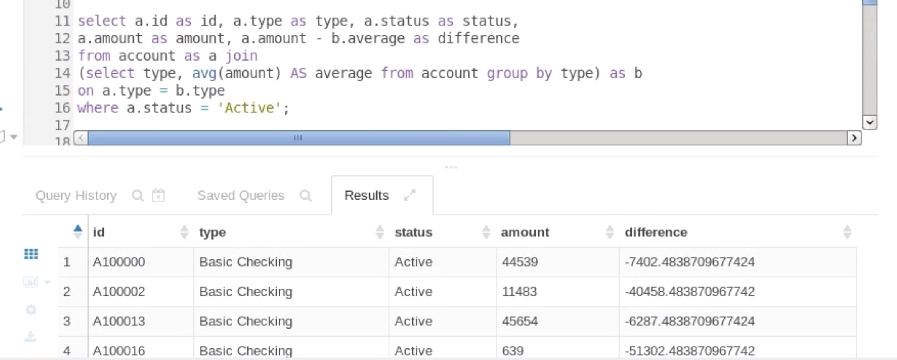
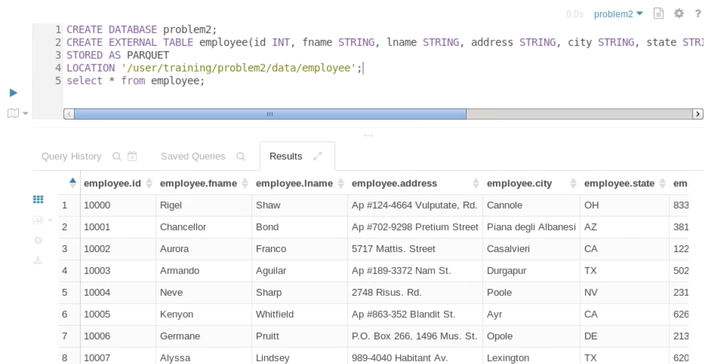
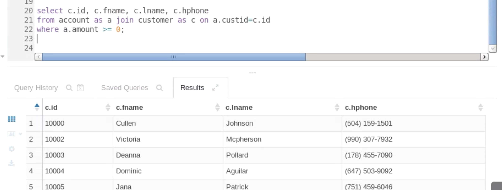
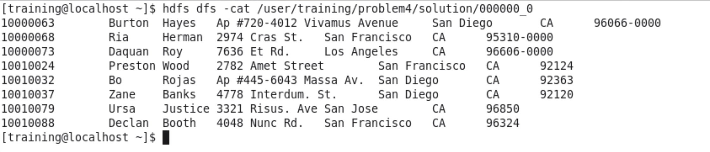
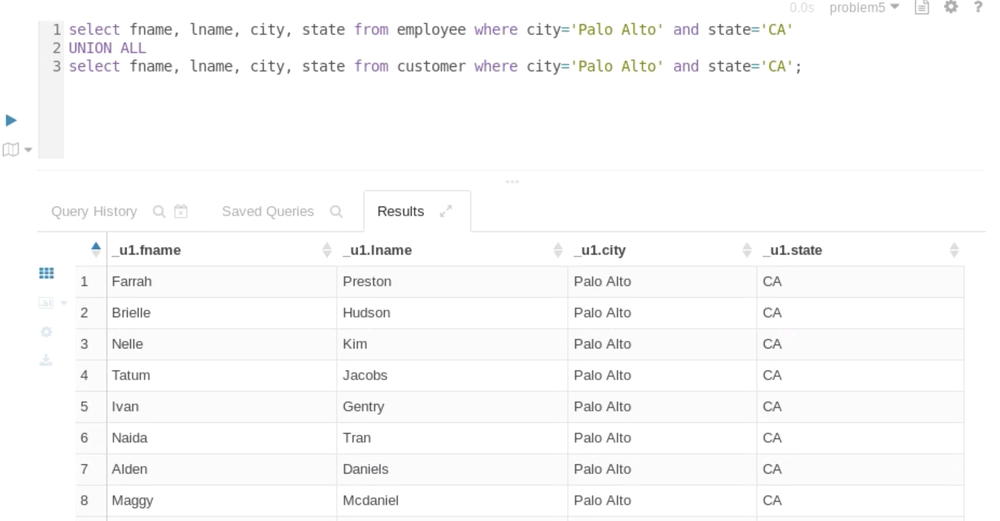
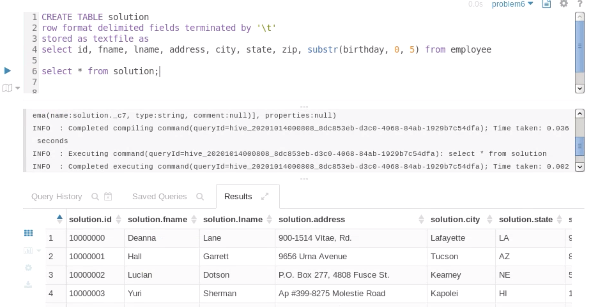
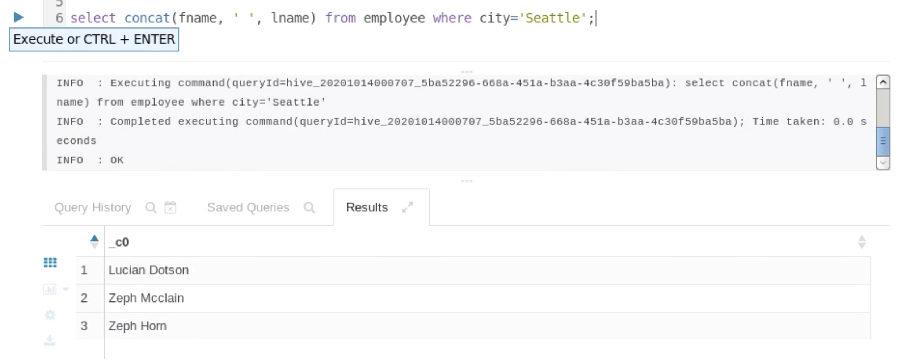
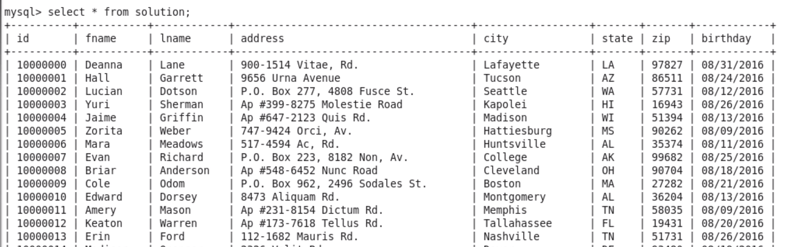
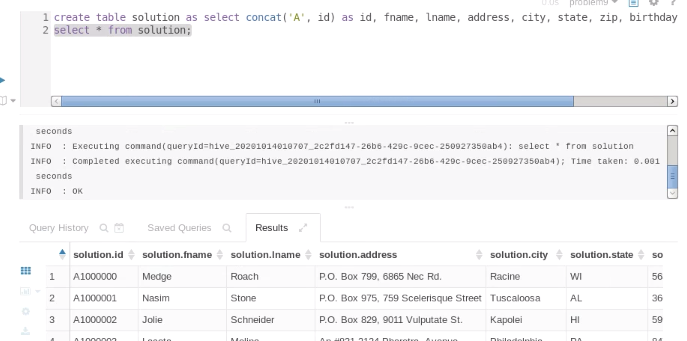

1번

```sql
SELECT a.id AS id, a.type AS type, a.status AS status, a.amount AS amount, 
a.amount - b.average AS difference FROM account AS a JOIN
(SELECT type, AVG(amount) AS average FROM account GROUP BY type) AS b
ON a.type = b.type 
WHERE status='Active';
```




2번

```sql
CREATE DATABASE problem2;
CREATE EXTERNAL TABLE solution(id INT, fname STRING, lname STRING, address STRING, city STRING, state STRING, zip STRING, birthday STRING, hireday STRING)
STORED AS PARQUET
LOCATION '/user/training/problem2/data/employee';
```



3번

```sql
CREATE TABLE solution STORED AS PARQUET AS
SELECT c.id AS id, c.fname AS fname, c.lname AS lname, c.hphone AS hphone 
FROM account AS a JOIN customer AS c ON a.custid=c.id 
WHERE a.amount < 0;
```



4번

```sql
CREATE DATABASE problem4;

CREATE EXTERNAL TABLE employee1(id INT, fname STRING, lname STRING, address STRING, city STRING, state STRING, zip STRING)
ROW FORMAT DELIMITED FIELDS TERMINATED BY '\t' 
STORED AS TEXTFILE 
LOCATION '/user/training/problem4/data/employee1';

CREATE EXTERNAL TABLE employee2(id INT, none STRING, fname STRING, lname STRING, address STRING, city STRING, state STRING, zip STRING)
ROW FORMAT DELIMITED FIELDS TERMINATED BY ',' 
STORED AS TEXTFILE 
LOCATION '/user/training/problem4/data/employee2';

CREATE TABLE solution 
ROW FORMAT DELIMITED FIELDS TERMINATED BY '\t' 
STORED AS TEXTFILE 
LOCATION '/user/training/problem4/solution' AS 
SELECT id, initcap(fname) as fname, initcap(lname), address, city, state, zip from employee1
UNION ALL
SELECT id, initcap(fname) as fname, initcap(lname), address, city, state, zip from employee2;
```



_**Instructor Comment: Should be Customer ID not id.  Did not unify the zipcode**_

5번

```sql
select fname, lname, city, state from employee where city='Palo Alto' and state='CA'
union all 
select fname, lname, city, state from customer where city='Palo Alto' and state='CA';
```



_**Instructor Comment: The output should be a single field delimited with tabs**_

6.

```sql
create table solution row format delimited fields terminated by '\t'
stored as textfile as
select id, fname, lname, address, city, state, zip, substr(birthday, 0, 5) from employee;
```




7.

```sql
select concat(fname, ' ', lname) as name from employee where city='Seattle') order by name;
```



8.

```bash
sqoop export \
--connect jdbc:mysql://localhost/problem8 \
--dirver com.mysql.jdbc.Driver \
--username cloudera \
--password cloudera \
--table solution \
-m 1 \
--export-dir '/user/training/problem8/data/customer/' \
--fields-terminated-by '\t' \
--columns 'id, fname , lname , address , city, state , zip , birthday';
```



9.

```sql
create table solution 
select concat('A', id) as id, fname, lname, address, city, state, zip, birthday from customer;
select * from solution;
```




10.

```sql
```


